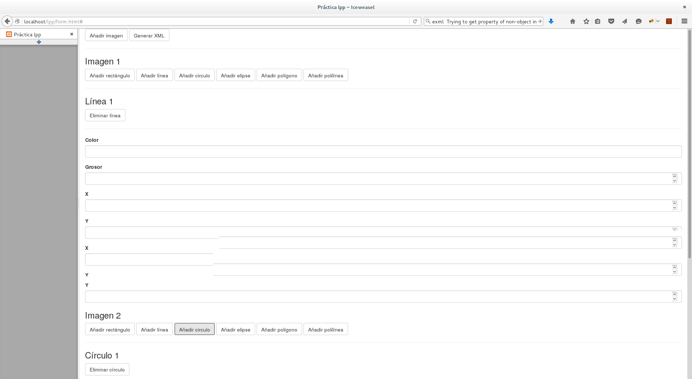
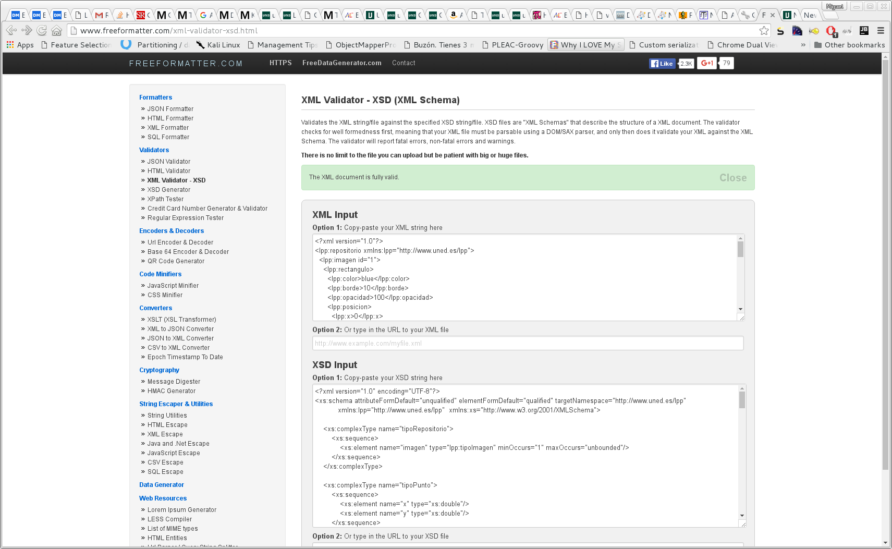
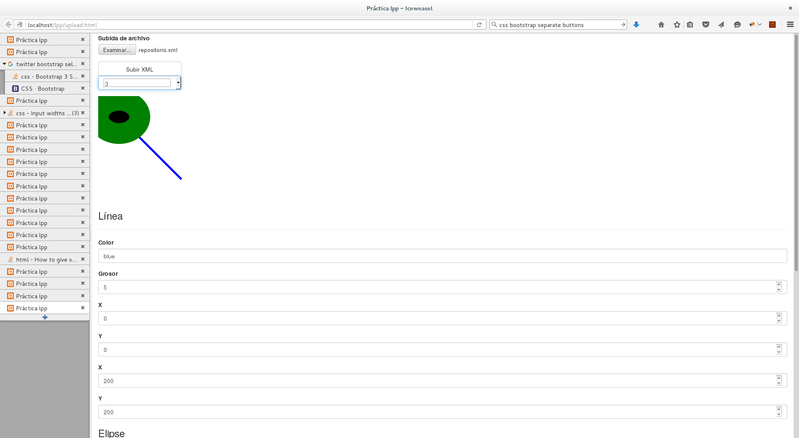

% Lenguajes de programación y procesadores - Código 71022028
% Miguel Expósito Martín - 72056097H - CANTABRIA

# Memoria de la práctica 2015-2016

## Parte 1

### Modelado del repositorio en XML-Schema

El XSD proporcionado representa una de las múltiples alternativas para modelar el repositorio de imágenes solicitado. Para su definición, se ha procurado maximizar la reutilización de tipos tal y como indica en el enunciado de la práctica. Los tipos de datos responden a las necesidades expuestas:

- `tipoRepositorio`: el repositorio en cuestión, que contiene como mínimo una imagen.
- `tipoPunto`: un tipo reutilizable que representa un punto con coordenadas (x,y), definida cada una de ellas como tipo `double`.
- `tipoForma`: un tipo reutilizable con los tres atributes comunes a varias entidades: color, borde y opacidad. Por sencillez, se modela color como una cadena de texto (permitiendo tanto códigos de color en hexadecimal como descripciones en inglés), el borde como entero no negativo y la opacidad como un tipo `decimal` limitado entre 0 y 1, dado que se trata de un porcentaje.
- `tipoRectangulo`: extiende `tipoForma` y presenta sus atributos propios en secuencia ordenada y con tipo `double`.
- `tipoCirculo`: ídem.
- `tipoElipse`: ídem. 
- `tipoLinea`: este tipo no extiende a `tipoForma` puesto que sólo presenta uno de sus tres atributos, `color`, presentando además `grosor` en vez de `borde`.. Contiene dos elementos de tipo `tipoPunto`.
- `tipoPolilinea`: tampoco extiende a `tipoForma` por la misma razón que el tipo anterior. Una polilínea puede contener un número ilimitado de elementos `tipoPunto`, partiendo de un mínimo de 2.
- `tipoPoligono`: extiende a `tipoForma` y presenta un mínimo de 3 elementos `tipoPunto`.
- `tipoImagen`: debe contener como mínimo una figura de entre todas las posibles. Para ello, se ha utilizado una secuencia con una estructura tipo `choice`, indicando que al menos una de las figuras posibles debe aparecer (no fijándose un límite superior).

Se ha comprobado que el XSD entregado es válido y bien formado a través de la herramienta online: [XML schema validator](http://schneegans.de/sv/Default.aspx), si bien el IDE utilizado para el desarrollo de la práctica, [PhpStorm](https://www.jetbrains.com/phpstorm/), también lleva a cabo la validación de forma continua.

### Aplicación PHP para crear instancias de repositorios

Esta parte de la práctica consta de los siguientes archivos:

#### Formulario HTML5 (`form.html`)

Para permitir la generación de un formulario con un número arbitrario de imágenes, figuras y puntos (en el caso de las figuras que los contengan), ha sido necesario utilizar tecnologías asíncronas y javascript (AJAX) a través de la biblioteca [JQuery](https://jquery.com/).

El formulario en un principio está prácticamente vacío, y a través de AJAX se añade el código HTML necesario para generar el formulario (el cual se encuentra inicialmente definido en variables Javascript). Aprovechando las capacidades de validación de HTML5, se han introducido las mismas restricciones que en el XSD a la hora de poblar los campos, de manera que no puedan introducirse valores incorrectos para los distintos atributos.

Mediante Javascript se manipula el DOM de la página en el propio cliente, sin necesidad de realizar llamadas al servidor. De esta forma se generan identificadores únicos para cada figura y cada uno de sus elementos, independientemente de que haya más de una figura del mismo tipo o no. La interfaz permite:

- Añadir un número arbitrario de imágenes al repositorio.
- Añadir un número arbitrario de figuras al repositorio, de cualquier tipo.
- Eliminar una figura existente dentro de una imagen.
- Añadir un número arbitrario de puntos en las figuras `tipoPoligono` y `tipoPolilinea`.
- Eliminar un punto añadido en los tipos citados en el punto anterior.

Plantear esta interfaz ha resultado ser una tarea compleja por la gran libertad que permite y la necesidad de control sobre identificadores y número de elementos de cada tipo en general. Depurar errores tampoco ha sido tarea fácil, debido al uso de AJAX. Estas tareas se han facilitado con la ayuda de herramientas como [Firebug](https://addons.mozilla.org/es/firefox/addon/firebug/) (complemento de desarrollador para Mozilla Firefox), [Chrome Developer Tools](https://developer.chrome.com/devtools) (el equivalente del anterior en Chrome) y el potente depurador Javascript integrado con Chrome de IntelliJ PhpStorm.

#### Página PHP de servidor (`form.php`)

La página PHP asociada al formulario anterior recibe en la petición de tipo `POST` todos los parámetros necesarios para generar un XML conforme con el XSD definido en el apartado anterior.

Para ello, usando la biblioteca requerida SimpleXML, se genera un documento XML vacío que se va poblando de manera sencilla manipulando la API que SimpleXML ofrece en función de los datos recibidos a través del formulario.

Finalmente, el documento resultante puede descargarse mediante el navegador convenientemente formateado a través de la API DOM.

Dicho documento, `repositorio.xml`, se ha validado frente al XSD definido en el apartado anterior en uno de los validadores online sugeridos: [FreeFormatter](http://www.freeformatter.com/xml-validator-xsd.html)

## Parte 2

### Aplicación PHP para visualizar SVG

La aplicación consta de los siguientes módulos:

#### Formulario de subida de repositorios y visualización (`upload.html`)

Esta página HTML es la entrada principal a toda la funcionalidad exigida en la segunda parte de la práctica. Desde ella, se accede a todos los requisitos establecidos. Para ello, se ha utilizado también tecnología Javascript asíncrona (AJAX) mediante `JQuery`.

Consta de las siguientes partes o pasos a seguir:

1. Subida del fichero XML (`repositorio.xml` )generado en el apartado anterior. Para ello, seleccionar el archivo mediante el cuadro de diálogo `Examinar` y subirlo mediante el botón `Subir XML`.

2. Una vez subido el archivo, permite seleccionar la imagen a visualizar. Para ello, pinchar en el selector `Seleccione imagen` y elegir una de las imágenes de ejemplo.

3. La imagen seleccionada se visualizará en un navegador compatible con SVG.

#### Página PHP de servidor para cargar el repositorio (`getimages.php`)

Esta página procesa el XML subido utilizando la biblioteca requerida XML-Parser, que presenta un enfoque orientado a eventos.

Para poder manejar más cómodamente la información proporcionada en el XML con el repositorio, se ha optado por utilizar la biblioteca anterior para transformar todo el documento en un array de arrays y otros tipos de PHP. Para ello, se procesan en los `parsers` los nombres de elementos, atributos y valores. Los elementos anidados se introducen en el elemento con clave `hijos`, proporcionando de esta forma una estructura repetitiva y homogéna fácilmente accesible desde PHP.

La página también guarda el resultado "parseado" en la sesión de la aplicación para un posterior uso, devolviendo únicamente un array con los identificadores de las imágenes contenidas en el repositorio, que se utilizará para alimentar un selector en el formulario `upload.html`.

De esta parte de la práctica se destaca la dificultad de uso de XML-Parser, debido a su naturaleza de bajo nivel. En contraprestación, es cierto que es más eficiente a la hora de llevar a cabo lecturas de documentos, si bien no es apropiado para modificar sus contenidos. Hoy en día, y de forma general, es más habitual utilizar bibliotecas que abstraigan al programador de tal complejidad, aunque por debajo utilicen este *parser*. 

#### Página PHP de servidor para transformar una imagen en SVG (`xmlparse.php`)

Esta página PHP se invoca asíncronamente cuando el usuario, desde la interfaz, selecciona una de las imágenes disponibles en el selector desplegable.

Utilizando el array procesado en la página anterior y el identificador de la imagen seleccionada, genera un SVG para dicha imagen que contenga todas las figuras existentes, realizándose un mapeo campo a campo.

Por lo general, los mapeos entre campos han sido prácticamente directos excepto en el caso de los puntos de coordenadas para polígonos y polilíneas, dado que SVG sigue un enfoque de incluirlos en un único elemento `points` con las coordenadas separadas por comas y entre sí por espacios, mientras que el XML diseñado presenta un elemento distinto para cada punto y coordenada.

### Formulario y aplicación para modificación de figuras y exportación

La última parte de la práctica utiliza el mismo formulario que el apartado anterior, `upload.html`, y dos páginas PHP adicionales.

La página `upload.html` muestra, además del SVG asociado a la imagen seleccionada, un formulario HTML5 en la propia página que permite modificar los atributos de las figuras representadas. Este formulario se genera también de manera dinámica usando AJAX y JQuery. Para aplicar los cambios una vez realizados, es necesario pulsar en el botón `Actualizar SVG`.

#### Página PHP de servidor para actualizar la visualización de SVG (`updatesvg.php`)

Para modificar el SVG existente se ha optado por volver a utilizar la biblioteca SimpleXML, dado que el enunciado no restringe explícitamente la tecnología y que XML-Parser no es una biblioteca adecuada para modificar documentos XML dada su naturaleza.

El script recorre todas las posibles figuras dentro de una imagen SVG y actualiza sus atributos (por sencillez, independientemente de que hayan sido modificados o no, dado que el formulario HTML se inicializa con los valores que tienen las figuras en ese momento). Los atributos se extraen de la petición `POST` realizada a través del envío del formulario correspondiente. 

Para poder realizar las actualizaciones correctamente, se toman como referencia los identificadores de las figuras incluidas en el SVG, que se corresponden con los identificadores de los elementos generados en el formulario.

Finalmente, el SVG actualizado se envía asíncronamente como XML y el cliente refresca el contenedor reservado al efecto.

#### Página PHP de servidor para exportar de nuevo el repositorio XML con los cambios incorporados (`export.php`)

Para poder exportar la imagen en SVG modificada de nuevo, y por las mismas razones expuestas en el apartado anterior, se utiliza de nuevo la biblioteca SimpleXML.

En este caso, la dificultad ha radicado en asignar correctamente las figuras repetidas en una estructura a las figuras repetidas en la otra. Para ello, se han recorrido los elementos del árbol con un bucle `foreach` y se han utilizado contadores internos para sincronizar los mapeos entre elementos.

El SVG se recoge a partir de la petición `POST` y el XML con el repositorio de la variable correspondiente almacenada en sesión. Se accede a la imagen modificada dentro del repositorio y se actualizan todos sus elementos en base al SVG enviado desde el navegador al ejecutar el envío del formulario.

Por último, el resultado con el repositorio actualizado se devuelve como XML listo para descargar por el navegador.

## Conclusiones

Como conclusión clara después de la realización de la practica se extrae que, en caso de no necesitar alto rendimiento en el procesado de los archivos XML, **es mucho más preferible utilizar una biblioteca de alto nivel basada en el DOM**. El procesado por eventos, si bien es más rápido, es más complejo de usar y menos flexible a la hora de modificar el contenido de los documentos, quedando su punto fuerte en la lectura de los mismos. Las bibliotecas de alto nivel, por otra parte, son muy potentes y sencillas de usar, lo que facilita enormemente la tarea del programador.

Por otra parte, si bien se trata de objetivos secundarios a la hora de la realización de la práctica, desarrollar las interfaces HTML5 con JQuery que permiten dar cumplimiento a los requisitos marcados es una tarea tediosa y no exenta de complejidad, dadas las libertades existentes a la hora de crear imágenes y figuras.

La práctica me ha permitido también conocer en mayor profundidad el estándar de imágenes vectoriales SVG, de gran sencillez a la hora de permitir la visualización de figuras básicas escalables en un navegador compatible con HTML5.

